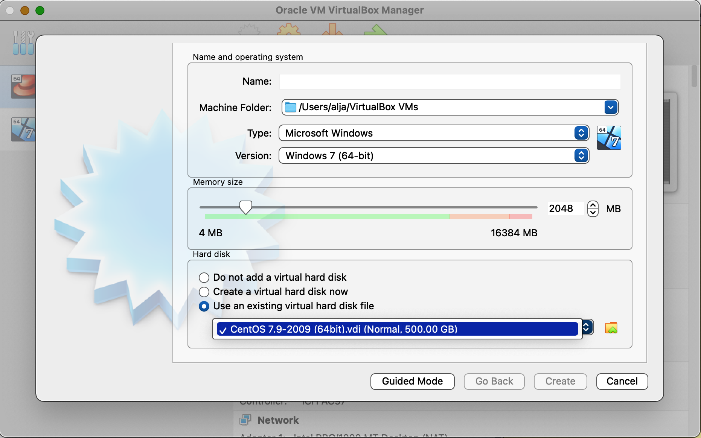

# fireworks-virtualbox
## 1. Install virtual box
 Download dmg for OSX. Att installation time grant *all* security permissions asked the install time (e.g. network) 

https://www.virtualbox.org/wiki/Downloads

## 2. Download centos-7 image 
https://cernbox.cern.ch/index.php/s/qmOGnySELgvA8d1

## 3. Create VM with the centos iamge

Run VirtualBox and create a new VM witj the Centos-7 image
 <!-- .element height="50%" width="50%" -->

## 4. Run Centos-7 VM 

Start VM with user 'osboxes.org' and password which is same as the username 'osboxes.org`
### Set autoresize or fixed resolution in the bottom right toolbar 
!
### 5. Download and run cmsShow

